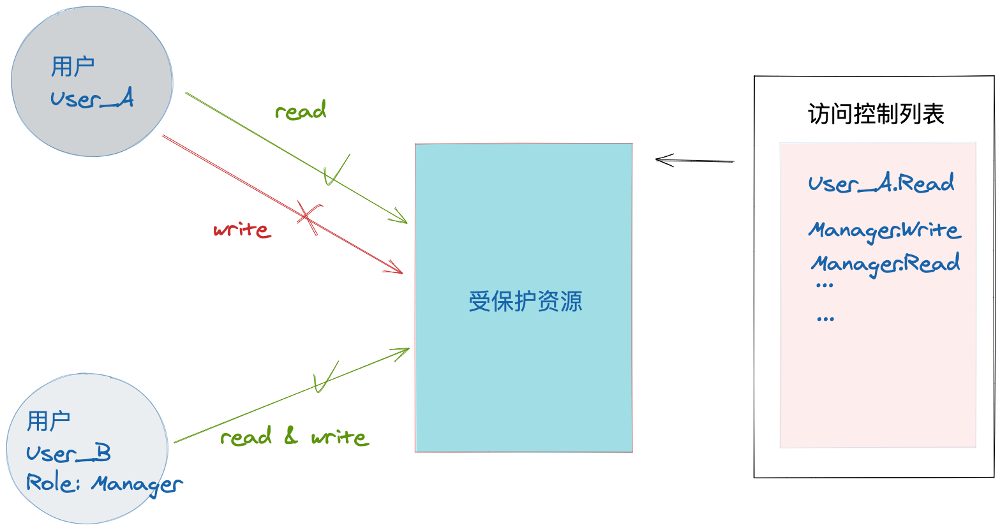
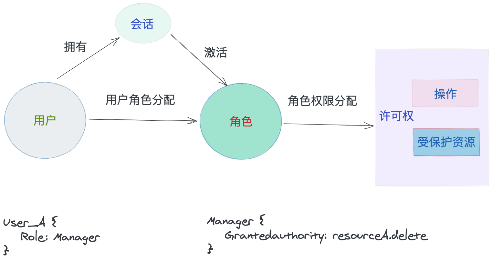

# 关于 ACL vs RBAC，你不得不应了解的两种权限管理模型

## 前言

权限管理发展历史？
为什么这两种会常用

## 什么是ACL

ACL？ 用图形化的方式来描述权限流程
ACL （Access Control List, 访问控制列表）是一种**面向资源的访问控制模型**。
因此，在ACL中，只需要为受保护资源进行权限配置。其原理在于，为每一个受保护资源配置一个访问控制列表，控制列表中记录对用户对资源的操作权限（读写等）。当某用户对此资源进行访问时，便会查询此资源的访问控制列表，并判断用户是否具有对此资源的访问权限。

如图所示，将受保护资源的读写权限分别可以赋予给User_A用户和Manager角色，在用户对受保护资源进行访问操作时，会更具ACL中的元素进行匹配判断，若存在，即可执行相关操作，否则则拒绝操作。
这便是ACL的核心思路：将受保护对象的权限划分，将某种权限可单独赋予某个用户或角色。即一个用户/角色可以具备某个对象的多种权限，某个对象的权限也可以被多个用户/角色持有，这便是权限与用户/角色的多对多关系。

分析其优劣
由此可见，ACL会将资源的权限进行细分，是一种**划分粒度非常精细**的权限控制，一般会精确的某一资源的具体某一权限。
同时，ACL的优劣也是非常明显的，ACL的优劣在于：因其会对每一资源的权限列表进行记录，而每一资源的访问控制列表可能会非常大，进而导致需要维护的数据库数据量非常庞大，维护大量数据可能会影响系统性能，当在大型系统中，其资源非常多时，其劣势尤为明显。
但在小型系统中，ACL是不存在问题的，因此在小型系统中仍可使用。

## 什么是RBAC
RBAC？ 用图形化的方式来描述权限流程
从上节了解，ACL权限控制粒度可达到每一资源的CRUD，如此细致的权限粒度会带来维护麻烦，扩展性弱的特点。因此，在大型系统中RBAC权限模型会更受欢迎。

RBAC（Role-based access control，基于角色的控制访问）是一种**面向角色的访问控制模型**。其将权限赋予角色，而不是直接赋予用户本身，避免了过度耦合，将用户授权管理变得简单且易于维护。
RBAC权限模型将用户按照一定规则划分为不同的角色，通过角色来确定是否用权限操作受保护资源。用户与角色关联，角色与权限关联，权限与资源关联，这些关系是一一对应的。
RBAC具有三大原则：
- 最小原则：给角色配置的权限是其完成任务所需的最小权限集合
- 职责分离：通过设定相互独立互斥的角色来实现角色的职责分离，比如申报人和审核人，申报人只能申报订单，审核人只能审核订单
- 数据抽象：借助于抽象许可权这样的概念实现的，如在账目管理活动中，可以使用信用、借方等抽象许可权，而不是使用操作系统提供的读、写、执行等具体的许可权。

对于角色而言，每个角色分配不同权限，以权限可以访问相应的资源，角色之间的关系可以通过角色的继承关系进行继承，从而实现权限的继承。

RBAC96是一个模型族，包括RBAC0~RBAC3四种模型。RBAC0是其中的核心模型，其余模型均是在其上扩展所得。
本文将对RBAC0进行详细介绍，其他模型可以自行查找或翻阅参考文献。

在RBAC0中，包含5个元素，用户，角色，许可权，操作，资源。

首先不考虑会话的存在，由图可知，
用户与角色处于多对多的关系，每个用户至少分配一个角色，也可以分配多个角色，用户在不同的场景可以使用不同的角色。而对应的每个角色也可以分配给不同的用户。
角色与许可权处于多对多的关系，每个角色至少分配一个许可权，也可以分配多个许可权，角色在针对不同的资源操作时使用不同的许可权。而对应的每个许可权也可以分配给不同的角色，比如管理员可以查看某人的某类订单信息，销售人员也可以查看个人的订单信息，不同角色对同一资源有相同的许可权。
许可权代表对当前资源的具体操作权限，比如读写删之类。
现在说回会话，会话是指用户在系统中的一次登录，一个用户可以创建会话并激活多个角色从而获得相应的访问权限。

RBAC1中增加了角色分级的概念，一个角色可以从另一个角色继承许可权。
RBAC2中增加了一些限制，强调在RBAC的不同组件中在配置方面的一些限制。
RBAC3称为统一模型，它包含了RBAC1和RBAC2，利用传递性，也把RBAC0包括在内。

分析其优劣
<!-- 但是在小型系统中，RBAC的优劣也是非常明显的，RBAC的优劣在于：因其不会对每一资源的权限列表进行记录，而每一资源的访问控制列表只会记录一个角色的权限，这便是权限与角色的一对一关系。 -->

## Spring-Security如何实现ACL和RBAC
### ACL
实现原理

### RBAC
实现原理

## Reference
- [权限系统与RBAC模型概述](https://blog.51cto.com/u_15278282/3021958)