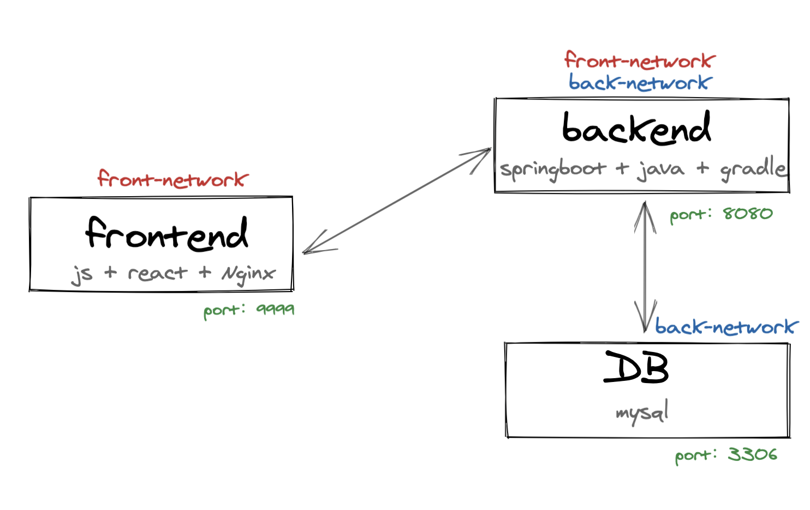

# Dockerfile 及 Docker-compose使用详解

前言：

本文将从如何定制Docker 镜像开始，主要分为两部分：Dockerfile和Docker-compose。

若读者从未使用过Docker，建议先了解Docker基本概念及相关指令再来阅读此文。


## Dockerfile 基础

众所周知，docker镜像是由多层文件系统联合组成，镜像构建时，是分层存储的前一层是后一层的基础，每一层构建完后不再改变，后一层的任何改变只发现在自己这层。

在docker中，运行一个容器的时候，将做的任何文件修改记录于容器存储层中。使用docker commit命令可以实现将容器的存储层保存为镜像。即，在原有镜像的基础上，叠加一层容器的存储层，以构成新的镜像。

### Dockerfile概念

镜像定制的本质是定制每一层添加的配置和文件。因此，可以使用脚本来构建、定制镜像，把每一层的修改、安装、构建、操作的命令写入脚本即可。这个脚本定义为Dockerfile。

Dockerfile 是一个用来构建镜像的文本文件，文本包含一条条构建镜像所需的指令和说明。每条指令构建一层，因此每条指令的内容，就描述该层如何构建。

使用```docker build``` 可以从Dockerfile文件中构建镜像，并且可以使用```-f```标志指向任何位置的Dockerfile类型文件。

注：```docker build``` 默认会选择当前文件夹下命名为Dockerfile的文件。

````bash
docker build -t name:version . 
docker build -f /path/to/dockerfile
````

tips：

docker build还可以通过git repo、指定tar压缩包、标准输入读取dockerfile内容方式构建镜像。

### Dockerfile指令

对于Dockerfile文件，一般分为四部分：基础镜像信息、维护者信息、镜像操作指令和容器启动时执行指令。’#‘ 为Dockerfile中的注释。

所谓定制镜像，就是以一个镜像为基础，在其上进行定制。

Docker从上到下顺序运行Dockerfile的指令。为了指定基本镜像，第一条指令必须是FROM。

本节将针对Dockerfile中的一些常用指令 ```FROM、MAINTAINER、RUN、COPY、CMD、ENTRYPOINT、EXPOSE、VOLUME、ENV``` 等进行详细讲解。

#### FROM: 指定基础镜像，必须为第一个指令

基础镜像可在Docker hub查找。

若不想以任何镜像为基础，则可以使用Docker的特殊镜像scratch。

```dockerfile
# 格式
	FROM <image>
	FROM <image>:<tag>
	FROM <image>@<digest>
# 示例
	FROM ubuntu:20.04
	FROM scratch
```

注：

- tag和digest是可选的，若不声明，会使用latest版本的基础镜像

#### RUN: 执行命名行命令

```dockerfile
# 格式
	RUN <command>	#shell执行
	RUN ["<excutable>","<param1>","<param2>"]	#exec执行
# 示例
	RUN apt-get update
	RUN ["./build.sh","dev","with_frontend"]
```

注：

- 因为每条指令都会建立一层，所以构建时每层东西不会自动在下一层删除。所以过多无意义的层会使镜像膨胀过大。构建时可以在构建完成后清理不需要的文件及缓存。

- RUN指令创建的中间镜像会被缓存，并会在下次构建中使用。如果不想使用这些缓存镜像，可以在构建时指定--no-cache参数，如：docker build --no-cache

#### COPY: 复制指令

将构建上下文目录中源路径的文件/目录复制到容器的指定路径中。

```dockerfile
# 格式
	COPY [--chown=<user>:<group>] <source1>...  <destination>
	COPY [--chown=<user>:<group>] ["<source1>",...  "<destination>"]
# 示例	
	COPY hom* /mydir/          # 添加所有以"hom"开头的文件
  COPY hom?.txt /mydir/      # ? 替代一个单字符,例如："home.txt"
  COPY test relativeDir/     # 添加 "test" 到 `WORKDIR`/relativeDir/
  COPY test /absoluteDir/    # 添加 "test" 到 /absoluteDir/
```

注：

- ``` [--chown=<user>:<group>]``` 是可选参数，表示改变复制到容器内文件的用户和用户组属性。

- 源文件或源目录，也可以使用通配符表达式 * 和 ？
- 目标路径不存在时会自行创建

#### ADD: 高级版复制指令

```dockerfile
# 格式
	ADD [--chown=<user>:<group>] <source1>...  <destination>
	ADD [--chown=<user>:<group>] ["<source1>",...  "<destination>"]
	ADD <url> <destination>
```

`ADD` 指令和 `COPY` 的格式和性质基本一致。但其相对COPY有一些区别。

1. 带有自动解压缩功能
2. 源路径可以是一个URL，网络资源（功能不实用，不推荐）
3. 会令镜像构建缓存失效，从而可能会令镜像构建变得比较缓慢。

仅需注意，所有的文件复制均使用 `COPY` 指令，仅在需要自动解压缩的场合使用 `ADD`。

#### CMD: 容器启动命令

为启动的容器指定默认运行的程序，程序运行结束，容器则结束。

```dockerfile
# 格式
	CMD <command> # shell 格式
	CMD ["<excutable>","<param1>","<param2>"] # excu格式
	CMD ["<param1>,<param2>,..."]	# 该写法是为 ENTRYPOINT 指令指定的程序提供默认参数
# 示例
	CMD echo "hello,dockerfile"
	CMD	["/usr/bin/wc","--help"]
```

注：

- CMD指令指定的程序可被docker run命令行参数中指定要运行的程序所覆盖。
- 若Dockerfile中存在多个CMD指令，仅最后一个生效。
- 类似于RUN，但CMD在docker run时运行，RUN在docker build时运行。

#### ENTRYPOINT: 入口点，配置容器使其可执行化

功能类似于CMD指令，但可以读取docker run 命令行参数传入其ENTRYPOINT指定程序。不会被docker run命令行参数覆盖。即执行docker run时可以指定ENTRYPOINT运行所需参数。

```dockerfile
# 格式	
	ENTRYPOINT ["executable", "param1", "param2"] #可执行文件, 优先
  ENTRYPOINT command param1 param2	#shell内部命令
# 示例
	ENTRYPOINT [ "curl", "-s", "http://myip.ipip.net" ]
	ENTRYPOINT curl -s <url>
```

注：

- 若在docker run 使用了 --entrypoint， 则也会覆盖ENTRYPOINT程序
- 若Dockerfile中存在多个ENTRYPOINT指令，仅最后一个生效。
- 指定ENTRYPOINT后，CMD含义发生改变，CMD内容(一般为变参)可作为参数传给ENTRYPOINT。```<ENTRYPOINT> "<CMD>"```,eg ```ENTRYPOINT ["top","-b"] CMD ["-c"]```代表```top -b -c```

#### ENV: 设置环境变量

定义环境变量。可用于后续指令和运行时应用。

通过环境变量可以使一份Dockerfile制作更多镜像，只需使用不同环境即可。

```dockerfile
# 格式
	ENV <key> <value> # key之后所有内容都是value，此格式一次只能设置一个ENV
	ENV <key>=<value> #此格式一次可设多个变量。对于空格，可使用”“包裹或者\符号转译。
# 示例
	ENV name John Vecito
	ENV name="VV KK" sex=male
```

注

- Dockerfile文件内引用ENV变量时，使用`${ENV_NAME}`即可。

#### ARG: 构建运行时参数

构建参数，类似于ENV，但作用域不同。ARG所设置的构建环境的环境变量，在将来容器运行时是不会存在这些环境变量的。即docker build过程中有效，构建好的镜像不存在此类参数。

```dockerfile
# 格式
	ARG <param_name>=<value>
# 示例
	ARG NODE_VERSION=7.10
```

注：

- 构建命令 docker build 中可以用 --build-arg <参数名>=<值> 来覆盖。
- ARG 指令有生效范围，如果在 FROM 指令之前指定，那么只能用于当前的 FROM 指令中。
- 若多阶段构建（以FROM分界），在各个阶段中使用的变量都必须在每个阶段分别指定。

#### VOLUME: 定义匿名卷（持久化容器内目录）

容器运行时应该尽量保持容器存储层不发生写操作，对于数据库类需要保存动态数据的应用，其数据库文件应该保存于卷(volume)。

Dockerfile中声明了匿名卷但是run的时候没有使用 -v绑定匿名卷的话那么docker就会在默认绑定容器匿名卷的目录下绑定匿名卷。

目的在于避免重要数据因重启而丢失，以及容器不断变大的问题。

```dockerfile
# 格式
	VOLUME ["path1","path2",...]
	VOLUME <path>
# 示例
	VOLUME /data
	VOLUME ["/dir/data","/etc/data"]
```

注：

- 启动容器docker run时，可以通过 -v 参数修改挂载点。
- 一个卷可以存在于一个或多个容器的指定目录，该目录可以绕过联合文件系统。
- 卷可以一直存在，并且可在容器内共享重用。
- 创建单独数据卷指令`docker volume create <VOLUME_NAME>`,挂载卷可使用`--mount`

#### EXPOSE: 暴露端口

声明运行时容器提供服务端口。EXPOSE 仅仅是声明容器使用的端口而已，并不会自动在宿主进行端口映射。

```dockerfile
# 格式
	EXPOSE <port1> <port2> ...
# 示例
	EXPOSE 3000
	EXPOSE 80 3000
	EXPOSE 6666/tcp 5555/udp
```

注：

- `docker run -P` 时，会自动随机映射 `EXPOSE` 的端口。
- `docker run -p`，是映射宿主端口和容器端口。将容器的对应端口服务公开给外界访问。而EXPOSE只是声明而已。

#### WORKDIR: 指定工作目录

用 WORKDIR 指定的工作目录，会在构建镜像的每一层中都存在。

因为Dockerfile每条指令都是一层，所以用cd指令并不能保证每条指令都在一个路径，因此WORKDIR可以指定工作目录，实现每层目录一致。

如该目录不存在，WORKDIR会帮你建立目录。

```dockerfile
# 格式
	WORKDIR <work_dir>
# 示例
	WORKDIR /app
```

#### USER: 指定当前用户

与WORKDIR类似，都是改变环境状态并影响以后的层。

USER改变的是执行指令的用户身份和用户组

但切换的用户必须事先已创建。

```dockerfile
# 格式
	USER <User_name>
# 示例
	RUN groupadd -r redis && useradd -r -g redis redis
	USER redis
```

#### ONBUILD: 执行延迟构建命令

ONBUILD指令后跟的其他指令。在当前镜像构建时并不会被执行。只有当以当前镜像为基础镜像，去构建下一级镜像的时候才会被执行。

```dockerfile
# 格式
	ONBUILD [INSTRUCTION]
# 示例
	ONBUILD ADD . /app/src
	ONBUILD RUN /usr/local/build --dir /app/src
```


还有一些其他指令，类似于HEALTHCHECK、LEBAL、SHELL等，此处不做讲解，有兴趣自行查看：https://docs.docker.com/develop/develop-images/dockerfile_best-practices/。


```dockerfile
# Demo: first nginx Dockerfile

# 基础镜像 centos v8
FROM centos:8

# 维护者 has been deprecated
MAINTAINER dragon.wang

ENV PATH /usr/local/nginx/sbin:$PATH

# download link:
# nginx: http://nginx.org/en/download.html
# epel: https://rpmfind.net/linux/rpm2html/search.php?query=epel-release
ADD nginx-1.18.0.tar.gz /usr/local/
ADD epel-release-7-13.noarch.rpm /usr/local/

RUN rpm -ivh /usr/local/epel-release-7-13.noarch.rpm
RUN yum install -y wget lftp gcc gcc-c++ make openssl-devel pcre-devel pcre && yum clean all
RUN useradd -s /sbin/nologin -M newuser

WORKDIR /usr/local/nginx-1.18.0

RUN ./configure --prefix=/usr/local/nginx --user=newuser --group=newuser --with-http_ssl_module --with-pcre && make && make install
RUN echo "daemon off;" >> /etc/nginx.configure

# 声明端口
EXPOSE 8888

CMD ["nginx"]
```


## Docker-compose基础

Docker Compose 是 Docker 官方开源的编排项目，负责实现对Docker容器集群的快速编排以实现快速的部署分布式应用。

一个项目可以由多个服务(容器)关联而成，Compose面向项目进行管理。

服务(service)：一个应用容器，实际上可以运行多个相同镜像的实例。

项目(project)：由一组关联的应用容器组成的一个完整的业务单元。


Docker Compose使用三步骤：

- 使用Dockerfile定义应用程序的环境
- 使用docker-compose.yml定义构成应用程序的服务，使各服务可以在隔离环境一起运行
- 执行docker-compose up命令来启动运行整个应用程序


### YML配置指令参考

Compose 是用于定义和运行多容器 Docker 应用程序的工具。通过 Compose，您可以使用 YML 文件来配置应用程序需要的所有服务。然后，使用一个命令，就可以从 YML 文件配置中创建并启动所有服务。

因此，YML配置十分重要。接下来将依次说明不同指令的含义：

#### version

指定当前yml文件将依从compose的版本。

`version: '2'`

#### build

指定构建当前镜像上下文路径，

`build: ./dir`

或者作为具有上下文指定路径的对象 (配置可选的Dockerfile和args)。

```yaml
build:
	context: ./dir #上下文路径
	dockerfile: dockerfile_dev #指定构建镜像的Dockerfile文件名
	args:
		env_var: var_in_build #添加构建参数，只能在构建过程中访问的环境变量
	labels: 
		- "com.example.label"=label #设置构建镜像的标签
	target: dev # 多层构建时，指定构建的哪一层
	cache_from: # 指定构建镜像的缓存
		- alpine: lastest
		- corp/web_app: 3.14 
```

#### cap_add/cap_drop

指定容器内核能力（capacity）的分配。

```yaml
cap_add: #add 添加功能
	- All	# 让容器拥有所有能力

cap_drop: #drop 删除功能
	- NET_ADMIN	# 去掉NET_ADMIN能力
```

#### command

覆盖容器启动时默认命令。

`command: echo "hello, docker-compoe's command"`

#### cgroup_parent

指定容器的父cgroup组，该容器可继承该组的资源限制。

`cgroup_parent: group_name`

#### container_name

`container_name: custom_name`

#### depends_on

设置容器之间的依赖关系，决定启动先后顺序。

当使用docker-compose up命令启动容器时，以依赖性顺序启动服务。

```yaml
version: "3.7"
services: 
	web: 
		build: .
		depends_on: 
			- db
			- redis
		redis:
			image: redis
		db:
			image: postgres
```

此示例存在依赖关系，会先启动db和redis，再启动web容器。但注意，web服务不会等redis、db完全启动后才启动。

#### devices

指定设备映射列表。

```yaml
devices:
 - "/dev/ttyUSB0:/dev/ttyUSB0"
```

#### dns

自定义DNS服务器，可以是一个值，也可以是一个列表的多个值。

```yaml
dns: 8.8.8.8

dns:
	- 8.8.8.8
	- 114.114.114.114
```

#### dns_search

自定义配置DNS搜索域，可以是单个值或列表的多个值。

```yaml
dns_search: example.com
dns_search:
	- dct1.example.com
	- dct2.example.com
```

#### entrypoint

覆盖容器默认的entrypoint。

`entrypoint: /code/entrypoint.sh`

当然，也可以是命令行格式

```yaml
entrypoint:
	- php
	- d
	- zend_extension=/usr/local/lib/php/extensions/no-debug-nono-zts
	- d
	- memory_limit=-1
	- vendor/bin/phpunit
```

#### env_file

从**文件**添加环境变量，可以是单个值或列表的多个值。

`env_file: .env`

列表格式：用于添加一组环境变量

```yaml
env_file: 
	- ./common.env
	- ./apps/web.env
	- /opt/secrets.env
```

环境变量文件中的每一行必须符合格式。

```yaml
PROG_ENV=development
```

#### environment

添加环境变量，可以使用数组或字典、任何布尔值。

```yaml
environment:
	RACK_ENV: development
	SHOW: 'true'
	SESSION_SECRET: 
	
environment:
	- RACK_ENV=development
	- SESSION_SECRET
	- SHOW='true'
```

注：

- 布尔值需要用引号引起来。
- 只给定名称的变量会自动获取运行compose主机上对应变量的值，可以用来防止泄露不必要的数据。

#### expose

暴露端口，但不映射到宿主机，只被连接的服务访问。仅可以指定内部端口为参数。

```yaml
expose:
 - "3000"
 - "8000"
```

#### extra_hosts

添加主机名映射。类似docker client --add-host

```yaml
extra_hosts:
	- "firsthostname:10.46.23.60"
	- "secondhostname:50.31.20.229"
```

以上会在此服务的内部容器中/etc/hosts创建一个具有ip地址和主机名的映射关系：

```yaml
10.46.23.60 firsthostname
50.31.20.22 secondhostname
```

#### healthcheck

通过命令用于检查容器是否健康运行。

```yaml
healthcheck:
 test: ["CMD", "curl", "-f", "http://localhost"] # 设置检测程序
 interval: 1m30s # 设置检测间隔
 timeout: 10s # 设置检测超时时间
 retries: 3 # 设置重试次数
 start_period: 40s #启动后，多少秒开始启动检测程序
```

#### image

指定为镜像名称或镜像ID。如果镜像在本地不存子啊，compose将会尝试拉取这个镜像。

```yaml
image: ubuntu
image: redis:8.1
image: orchardup/postgresql
image: example-registry.com:4000/mysql
image: a4bc65fd
```

#### loggging

服务的日志记录配置。

driver: 指定服务容器的日志记录驱动程序，默认值为json-file。具有三个选项：`json-file、syslog、none`

option 配置日志驱动的相关参数

- json-file示例（可以使用参数max-size、max-file限制日志的数据和大小）

  ```yaml
  logging:
   driver: json-file
   options: 
   	max-size: "200k" # 单个文件大小为200k
   	max-file: "10" # 最多10个文件
  ```

  注：当达到文件限制上限，会自动删除旧的文件。

- syslog驱动程序下，可以使用**syslog-address指定日志接收地址**

  ```yaml
  logging:
  	driver: syslog
  	options:
  		syslog-address: "tcp://192.168.0.42:9999"
  ```

#### network_mode

设置网络模式。使用和docker run的 --network 参数一样的值。

```yaml
network_mode: "bridge"
network_mode: "host"
network_mode: "none"
network_mode: "service:[service name]"
network_mode: "container:[container name/id]"
```

#### networks

配置容器连接的网络，引用顶级networks下的条目。

```yaml
services:
	custom-service:
		networks:
			first-network:
				aliases:
					- alias1
			second-network:
				aliases:
					- alias2
	networks:
		first-network:
			driver: custom-driver-1	# use a custom driver
		second-network:
			driver: custom-driver-2 # use a custom driver which takes special options
```

注：

- aliases: 同一网络上的其他容器可以使用服务名称或此别名来连接到对应容器的服务。

#### secrets

用于存储敏感收据。比如密码等

```yaml
version: "3.1"
services:
# ......
mysql:
	image: mysql
	environment:
		MYSQL_ROO_PASSWORD_FILE: /run/secrets/db_secret
	secrets:
		- db_secret
		- other_secret
		
secrets:
	db_secret:
		file: ./my_secret.txt
	other_secret:
		external: true
```

#### security_opt

修改容器默认的schema标签。指定容器模板标签（label）机制的默认属性（用户、角色、类型、级别等）。

```yaml
security-opt:
	- label:user:USER	# 设置容器的用户标签
	- label:role:ROLE	#	设置容器的角色标签
	- label:type:TYPE	#	设置容器的安全策略标签
	- label:level:LEVEL	#	设置容器的安全等级标签
```

#### sysctls

设置容器中的内核参数，可以使用数组或字典格式。

```yaml
# 字典格式
sysctls:
	net.core.somaxconn: 1024
	net.ipv4.tcp_syncookies: 0
	
# 数组格式
sysctls:
	- net.core.somaxconn=1024
	- net.ipv4.tcp_syncookies=0
```

#### tmpfs

在容器内安装一个临时文件系统。可以是单个值或列表的多个值。

```yaml
# 单值形式
tmpfs: /run
# 列表形式
tmpfs:
	- /run
	- /tmp
```

#### ports

暴露端口信息以供外部服务调用。使用主机端口：容器端口格式(HOST:CONTAINER)。或者可以只指定容器的端口，主机端口将随机选择。

```yaml
ports:
	- "3000"
	- "8000:8000"
	- "41900:22"
	- "127.0.0.1:8001:8001"
```

注：

- 建议数字串都采用引号包括起来的字符串格式。

#### ulimits

指定容器的ulimits限制值。

```yaml
ulimits:
	nproc: 65535	# 指定最大进程数65535
	nofile:
		soft: 20000	# 指定文件句柄数20000（软限制，应用随刻可以修改）
		hard: 40000 # 指定文件句柄数40000（硬限制，只能root用户提高）
```

#### volumes

数据卷所挂载路径设置。形式可以为：

宿主机路径：容器路径（HOST: CONTAINER）

数据卷名称：容器路径（VOLUME: CONTAINER）

同时，挂载的卷可以设置访问模式（eg. HOST: CONTAINER: ro）

```yaml
version: "3.7"
services:
	db:
		image: postgres:8.0
		volumes:
			- /data/postgres.sock:/var/run/postgres/postgres.sock
			- /tmp/data:/var/lib/postgresql/data
			- sql_data:/var/lib/sql
			
volumes:
	sql_data:
```


当然对于配置文件而言，还有很多指令`domainname, hostname, ipc, mac_address, privileged, read_only, shm_size, restart, stdin_open, tty, user, working_dir`等，此处不再一一讲解。

具体查询可再看此link：https://github.com/compose-spec/compose-spec/blob/master/spec.md

### docker-compose 常用命令

```bash
docker-compose -v/version #	查看版本
docker-compose build #	构建或重新构建服务
docker-compose ps	#	列出本地运行的容器	[-q 只列出id]
docker-compose images # 列出本地运行的镜像	[-q 只列出id]
docker-compose logs -f --tail 200 <service_name> #	跟踪打印service最后20行日志
docker-compose up [option_param] #	默认为前台构建、启动容器	[-d 后台构建、启动容器]
docker-compose start <service_name> #	启动容器，但可能不是读取最新的yml配置
docker-compose stop/kill <service_name> #	停止容器
docker-compose pull # 下载服务镜像
docker-compose run <service_name> <command> # 在服务上执行一个命令
docker-compose port <service_name> <ports> #	打印服务上绑定的对外端口
docker-compose network ls #	查看所有网络配置
......
```

更多指令查询可查看link：https://docs.docker.com/compose/reference/


## Practice

Github repo:(可联系博主申请权限)
https://github.com/dragonwang-hub/docker-compose-front-back-sql
**前提：**

已存在可本地运行的前后端分离项目。

- Frontend: react+js+parcel
- Backend:  springboot+java+gradle
- SQL: mysql:8

**需求：**

目前已有项目需要使用Dockerfile构建镜像，并使用Docker-compose进行编排容器管理启动。

- 使用docker-compose up运行，即可在物理机运行项目。
- SQL数据持久化, restart不影响数据。
- 分布在不同的networks。

### Dockerfile构建镜像

**frontend**

```dockerfile
# # Stage 1
FROM node:14 as build-step
WORKDIR /app
COPY . /app
RUN yarn install
RUN yarn build

# # Stage 2
FROM nginx:1.19
COPY ./app/dist /usr/share/nginx/html # 此处使用parcel打包工具，因此build后文件在dist目录下
COPY ./app/nginx.conf /etc/nginx/conf.d/default.conf
EXPOSE 80
```

注：

若本地已build过前端项目，已产生build后的文件，则直接进入stage2进行打包镜像，注释掉stage1代码即可。

（当然，目前只是build docker镜像，不曾考虑部署服务器。具体命令含义可参考本文基础部分）

**backend**

```dockerfile
FROM openjdk:8

COPY build/libs/*.jar /app.jar
ENTRYPOINT ["sh", "-c", "java $JAVA_OPTS -jar /app.jar"]
EXPOSE 8080
```

直接将编译好的jar包存在镜像内，并使用java -jar命令运行即可。

### docker-compose 编排容器

**架构图**

 

**代码**

```yaml
version: '3'
services:
  mysql:
    restart: always
    container_name: mysql-8
    image: library/mysql:8.0.22
    environment:
      MYSQL_DATABASE: final_quiz
      MYSQL_USER: root
      MYSQL_PASSWORD: password
      MYSQL_ROOT_PASSWORD: password
    ports:
      - "3306:3306"
    expose: 
      - "3306"
    volumes: 
      - "db_sql:/var/lib/mysql"
    networks:
      - back-network

  backend:
    restart: on-failure
    container_name: backend
    build: ./B-final-quiz/ # dockerfile 路径
    environment:
      SPRING_DATASOURCE_URL: jdbc:mysql://mysql:3306/final_quiz
      SPRING_DATASOURCE_USERNAME: root
      SPRING_DATASOURCE_PASSWORD: password
    expose:
      - "8080"
    ports:
      - "8080:8080"
    depends_on:
      - mysql
    networks:
      - back-network

  frontend:
    restart: on-failure
    container_name: frontend
    build: ./F-final-quiz/ # dockerfile 路径
    expose: 
      - "80"
    ports: 
      - "9999:80"
    networks: 
      - front-network
# 使用networks划分不同网络
networks:
  back-network:
  front-network:
# 创建volume卷挂载实现持久化
volumes:
  db_sql:

```
至此，一个简简单单的前端-后端-数据库的docker-compose编排示例就完结了。

希望这篇文章对您有所帮助，感谢阅读~
**Reference:**
https://www.cnblogs.com/panwenbin-logs/p/8007348.html#autoid-1-0-0
https://yeasy.gitbook.io/docker_practice/compose/commands