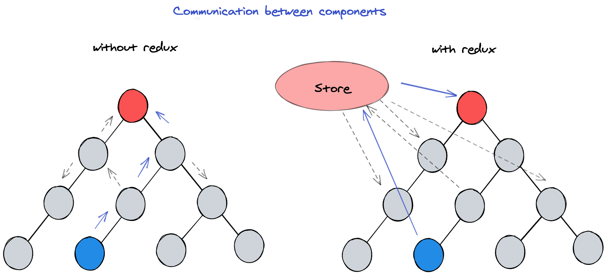
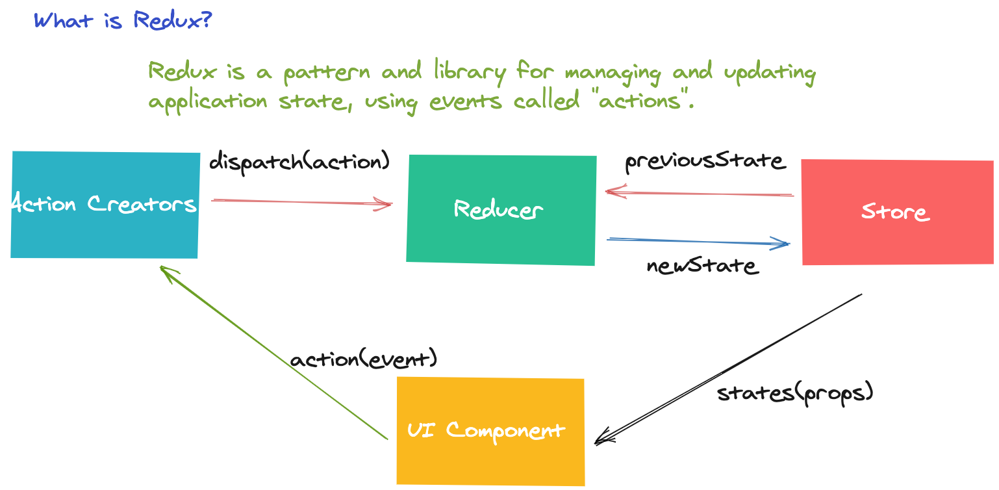
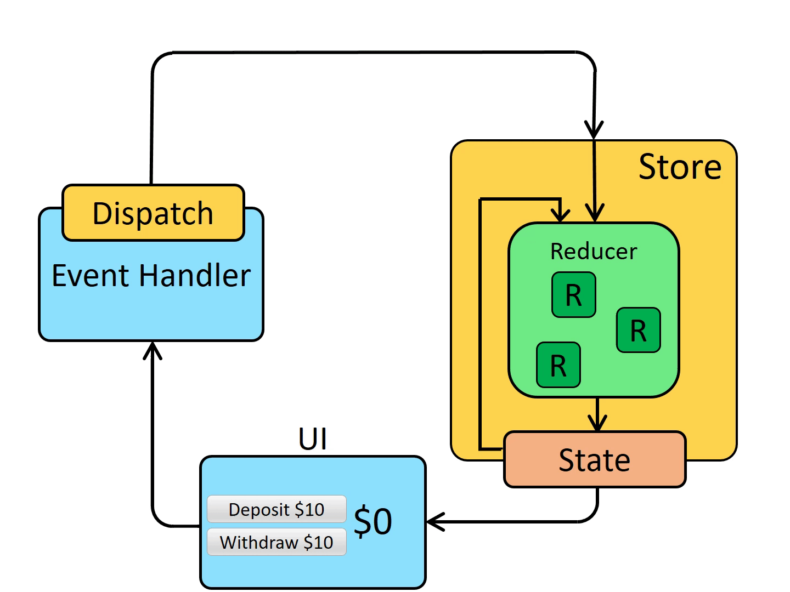

---

title: 10 Minutes To Get Started React-Redux
date: 2021-05-21 10:55:54
author: Dragon
toc: true
mathjax: false
categories: Tech Improvement
tags:
    - react-redux
    - store
    - reducers
---

# 10 Minutes To Get Started React-Redux

## Introduction

Let's start with a question. Why we need to use Redux?

We can look at the picture below firstly. The picture shows the communication between components.

Without redux, if communication is required between two components that have non-parent-child relationships, multiple middle components may be required to deliver messages for them, which wastes resources and makes the code more complex.

Look at the right part, Using Redux to manage the global state **make it easier** to update the state in your application. Redux can help you manage "global" state - The state that is needed across many parts of your application.




What is Redux? Redux is a pattern and library for managing and updating application state, using events called "actions".  Look at this picture. Redux proposes a single data source, `Store`, which is used to store the global state data. Components can modify state via `Action`, and fetch the latest state from the Store. Redux is the perfect solution to the communication problem between components.



> After understanding what Redux can be used for, we will know applicable scenarios of Redux. That is Multiple components need to share and use the same state.

## Basic terminology

To better understand the `Redux Application Data Flow`, we need to understand some basic terminology.

- Actions  : **You can think of an action as an event that describes something that happened in the application**. In the app code, its manifestation is an object.
- Action Creators  : In the app code, It is the **function used for creating the action object.**
- Reducers  : **You can think of a reducer as an event listener which handles events based on the received action (event) type.**
- Store : It can be thought of a **global state object** and used to store state data.
- Dispatch  : **You can think of dispatching actions as "triggering an event"**. The Redux store has a method called `dispatch`.  This is also the default property for higher-level components wrapped with `connect`.

Now, we can look at the data flow of redux application together.

For the initial setup, there are three steps.  The first step is to create a Redux store using a root reducer function. Then the store saves the return value as the root reducer initial state. Next the UI starts the first render,  UI components access the current state of the Redux store and use that data to decide what to render.

For the update process, there are five steps. Firstly, some events happen in the UI. Such as the click action. Then, the app code dispatches an action to the Redux store. Next, The store runs the reducer function again with the previous state and the current action and saves the new state. Then, the store notifies all parts of the UI that are subscribed to that the store has been updated. Finally, each UI component that the state has changed forces a re-render with the new state, so it can update UI.



Next part we'll introduce the redux component structure and how to quickly use redux in your application.

<hr>

When you use react-redux. You need to build the `Store`, `Reducer`, `Action` , and so on.

But before we talk about how to code these modules, we are better to understand what are UI/Container components on the `react-redux application`.

## UI/Container Components layer structure

- UI components are concerned with ***how things look***.
- Container components are concerned with ***how things work***.

Most of the components should be presentational, but if need to use global state,  a few container components are needed to connect them to the Redux store.

We can look at the comparison table about UI and Container components.

|                    | UI Components                   | Container Components                        |
| :----------------- | :------------------------------ | ------------------------------------------- |
| Function           | How things look（Frame、Style） | How things work（Fetch data、Update state） |
| Use Redux directly | No                              | Yes                                         |
| Data  from         | props                           | Redux state (Store)                         |
| How  update state  | props.func                      | Redux dispatch actions                      |

## How To Build Container Components

**Connect** 

On the `react-redux application`, we can use `connect()`  function to build the UI component as the container component.

The `connect()` function connects a React component to the Redux store. It provides its connected component with the data it needs from the store, and the functions it can use to dispatch actions to the store.

Next, I would introduce two core param on the connect function.

**mapStateToProps**

As the first param passed in to `connect`, `mapStateToProps` is used for selecting the part of the data from the store that the connected component needs. 

> It’s frequently referred to as just `mapState` for short.

- It is called every time the store state changes.
- It receives the entire store state, and should return an object of data this component needs.

In one sentence, `mapStateToProps`  is used for mapping states in redux to props of UI components for synchronous updates.

**mapDispatchToProps**  

As the second param passed in to `connect`, `mapDispatchToProps` is used for dispatching actions to the store.

Providing a `mapDispatchToProps` allows you to specify which actions your component might need to dispatch. It lets you provide action dispatching functions as props.

Dispatch the UI Component action to the store, then update the state according to the reducer rules.

> Actually, the `react-redux` already update the hook function following react update.
>
> - useSelector() [Fetch store state]:Allows you to extract data from the Redux store state.
> - useDispatch() [Dispatch action]
>
> It is more convenient, but still has learned new concepts about `Slice`.
>
> *Note: Building `Store` also is complex. But for a simple project, you can use the`Redux Toolkit` tool.*

## Get Started

For using `react-redux`, there are five main steps:

1. createStore() / configureStore() -> Create the `Store` for store global states.
2. Provider -> Set Store to be available within all components.
3. Actions(Action Creators)/Reducers -> Set initial state and update policy
4. connect() -> Upgrade UI components to container components.
5. mapStateToProps/mapDispatchToProps ->  Implementing data mapping, and action dispatching.

## Demo 

Specific source code : Github Link: [Counter Demo Example](https://github.com/dragonwang-hub/react-redux-counter-demo)


Understood these concepts and functions, we can look at a demo about the `react-redux`.

Firstly, look at Counter UI and Container. The UI component just shows how things look. It has some props that are mapped from states of redux `Store`. The container component connects the Redux and implements how things work.

If we are not using redux, the count is just a property of the counter component. But if we were to store count as a global variable using redux, count is the state in the `Store` of redux, only the counter is using this state.

**UI Comopoent**

```jsx
import React, { useState } from "react";
import PropTypes from "prop-types";
import styles from "./Counter.module.css";

function Counter(props) {
  ...
  const { count, increment, decrement, incrementByAmount } = props;
  ...
  return (
    // UI element
    ...
    ...
  );
}

Counter.propTypes = {
  count: PropTypes.number,
  increment: PropTypes.func,
  decrement: PropTypes.func,
  incrementByAmount: PropTypes.func,
};

Counter.defaultProps = {
  count: 0,
  increment: () => {},
  decrement: () => {},
  incrementByAmount: () => {},
};

export default Counter;
```

**Container Component**

```jsx
import { connect } from "react-redux";
import Counter from "./Counter";
import * as actions from "../redux/action";

const increment = (dispatch) => () => {
  dispatch(actions.incrementValue());
};

const decrement = (dispatch) => () => {
  dispatch(actions.decrementValue());
};

const incrementByAmount = (dispatch) => (incrementValue) => {
  dispatch(actions.incrementByAmount(incrementValue));
};

const mapStateToProps = (state) => ({
  count: state.counter.count,
});

const mapDispatchToProps = (dispatch) => ({
  increment: increment(dispatch),
  decrement: decrement(dispatch),
  incrementByAmount: incrementByAmount(dispatch),
});

export default connect(mapStateToProps, mapDispatchToProps)(Counter);

```

Then look at the file structure of redux. There are `store`,`reducer`,`action`,`actionType`. 

**Store**

Use the `@reduxjs/toolkit` make it easier create the `Store`.

```jsx
import { configureStore } from "@reduxjs/toolkit";
import { counterReducer } from "./reducer";

export const store = configureStore({
  reducer: {
    counter: counterReducer,
  },
});
```

**Reducer**

```jsx
import * as actionTypes from "./actionType";

const initialState = { count: 0 };

export const counterReducer = (state = initialState, action) => {
  switch (action.type) {
    case actionTypes.INCREMENT_VALUE:
      return {
        ...state,
        count: state.count + 1,
      };
    case actionTypes.DECREMENT_VALUE:
      return {
        ...state,
        count: state.count - 1,
      };
    case actionTypes.INCREMENT_BY_AMOUNT:
      return {
        ...state,
        count: state.count + action.payload,
      };
    default:
      return state;
  }
};
```


**Action**
```jsx
import * as actionTypes from "./actionType";

export const incrementValue = () => ({
  type: actionTypes.INCREMENT_VALUE,
});

export const decrementValue = () => ({
  type: actionTypes.DECREMENT_VALUE,
});

export const incrementByAmount = (amount) => ({
  type: actionTypes.INCREMENT_BY_AMOUNT,
  payload: amount,
});
```

```jsx
export const INCREMENT_VALUE = "INCREMENT_VALUE";
export const DECREMENT_VALUE = "DECREMENT_VALUE";
export const INCREMENT_BY_AMOUNT = "INCREMENT_BY_AMOUBT";
```

**Index.js**

```jsx
import React from 'react';
import ReactDOM from 'react-dom';
import './index.css';
import App from './App';
import { store } from './redux/store';
import { Provider } from 'react-redux';
import * as serviceWorker from './serviceWorker';

ReactDOM.render(
  <React.StrictMode>
    // It is main point. Set Store available
    <Provider store={store}>
      <App />
    </Provider>
  </React.StrictMode>,
  document.getElementById('root')
);
```

If you're interested, you can implement the demo yourself later, it's a good way to quickly understand how redux works.

Clone the [Counter Demo Example](https://github.com/dragonwang-hub/react-redux-counter-demo) to start to code the first react-redux project belongs to you now.


## Reference

1. [UI/Container Components](https://medium.com/@dan_abramov/smart-and-dumb-components-7ca2f9a7c7d0)
2. [Basic Concepts](https://redux.js.org/tutorials/essentials/part-1-overview-concepts)
3. [Connect Function](https://react-redux.js.org/using-react-redux/connect-mapstate)

