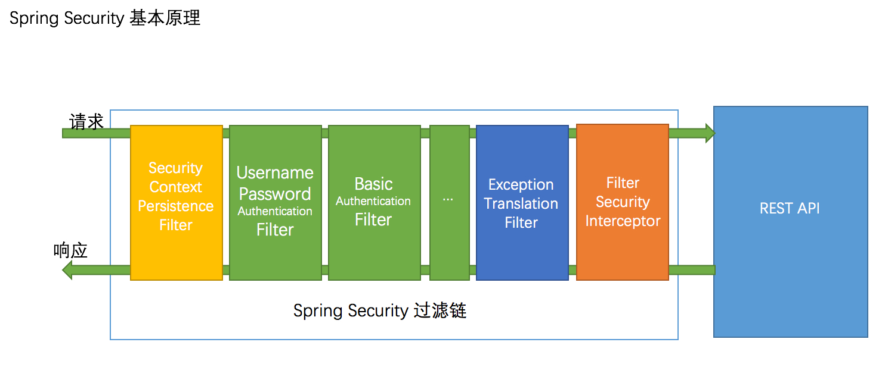
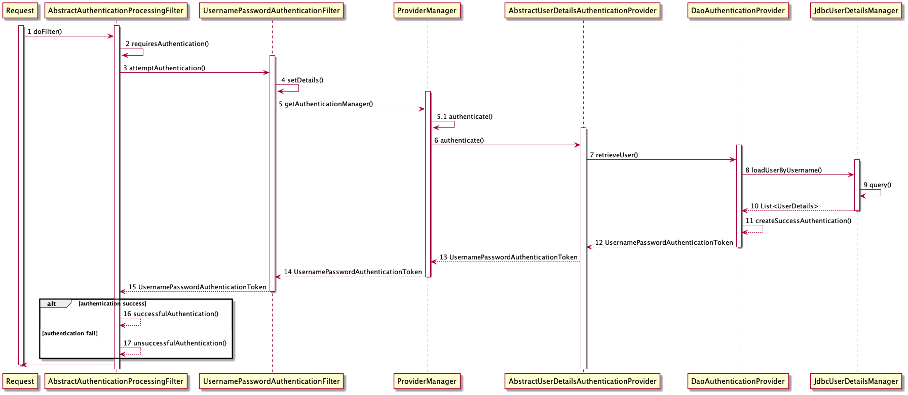
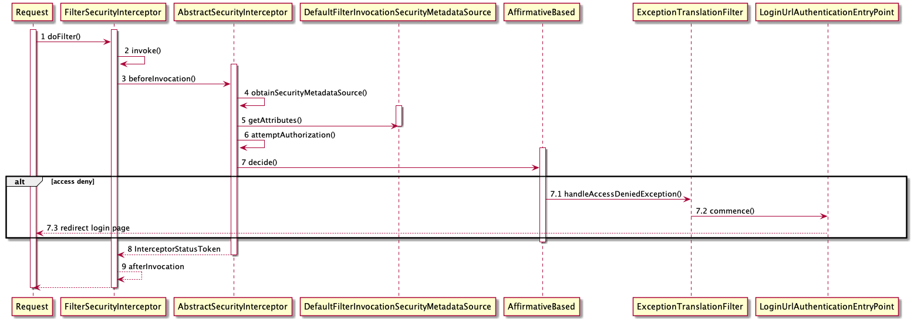

# Spring Security认证与授权源码分析

## 引言
任何系统服务的使用，安全问题不可忽视，对于系统而言，Authentication和Authorization是两个比较重要的概念，它们分别对应于用户认证和用户授权。
- Authentication: 认证是什么？认证是指用户身份的验证，即用户的**身份**是否合法，是否有效，是否可用。代表着的是**可以访问系统**的一个标志。*我可以吗？*
- Authorization: 授权是什么？授权是指用户对资源的访问权限，即用户对**资源的访问权限**是否合法，是否有效，是否可用。代表着的是**可以访问资源**的一个标志。*我能做什么？*

比如登录页面，必然是认证过程，而登录成功后，需要授权才能访问某些特殊页面，比如查看公司所有员工薪资等操作，这个过程就需要一定权限。

在Spring生态圈中，Spring-Security是主要负责系统认证与授权的重要组件，它是一个完整的认证框架，包含了认证、授权、访问控制、访问控制等等。

>Spring Security’s web infrastructure is based entirely on standard servlet filters.   
Security的核心逻辑是基于Filter进行封装的，本质上就是在Http的请求链路上进行Filter的功能扩展。 

在Java web中，一个request请求会经过一条过滤器链，最终到达servlet层面进行处理，这些过滤器的顺序是固定的，可以通过配置文件进行配置。在经过过滤器链的过程中会完成认证与授权，如果中间发现这条请求未认证或者未授权，会根据被保护API的权限去抛出异常，然后由异常处理器去处理这些异常。

如图所示：

- 黄色：SecurityContext安全上下文管理
- 绿色：认证过滤器
- 红色：授权过滤器
- 蓝色：异常处理过滤器

其核心的认证与授权过程也是基于几个已定义好的Filter实现的，本文将针对认证与授权过程中使用的Filter源码分析，以梳理认证与授权具体流程。

## 认证Authentication

认证过程也是处于一个请求在经过过滤器链时某一过滤器环节。Filter便是过滤器的接口类。认证过程中最主要的Filter是`AbstractAuthenticationProcessingFilter`和`UsernamePasswordAuthenticationFilter`,而后者其实是前者的子类。

### 时序图

认证时序图如下：（只记录了作者认为重要的步骤）



接下来对时序图中涉及的类作用进行简要介绍：

- `AbstractAuthenticationProcessingFilter`和`UsernamePasswordAuthenticationFilter`,它们的主要作用是获取用户名和密码，并进行认证以及认证成功和失败的处理操作，是认证流程中的核心。
- `ProviderManager` 认证管理中心，相当于一个策略模板，根据传入的认证信息，选择不同的认证处理器进行处理。达到了认证集中管理的效果。其本身不处理认证请求，而是将任务委托给一个配置好的`AuthenticationProvider`的列表，其中每一个`AuthenticationProvider`按序确认能否完成认证，每个provider如果认证失败，会抛出一个异常，如果认证通过，则会返回一个`Authentication`对象。
- `AbstractUserDetailsAuthenticationProvider`和`DaoAuthenticationProvider`,二者完成具体认证操作，其中`AbstractUserDetailsAuthenticationProvider`是一个抽象类，它实现了`AuthenticationProvider`接口，而`DaoAuthenticationProvider`是它的子类，它的主要作用是获取用户信息，并进行认证，以及构造认证成功`Authentication`对象。
- `JdbcUserDetailsManager`, `UserDetailsService`接口的实现类，实现从具体数据库查询`UserDetails`信息并返回。
- `UsernamePasswordAuthenticationToken`, `Authentication`的实现类，作为`Authentication`对象返回给`AbstractAuthenticationProcessingFilter`。

以上便是认证流程中较为重要的角色的作用，接下来我们可对时序图具体流程结合源码进行分析，将摘取了作者个人认为较为重要的方法，若有不同见解，可查阅其他资料。

### 源码分析
1. `AbstractAuthenticationProcessingFilter.doFilter`

一个request将经过此过滤器进行认证操作。认证成功则进入successfulAuthentication处理，失败则进入unsuccessfulAuthentication处理。

```java
public abstract class AbstractAuthenticationProcessingFilter extends GenericFilterBean implements ApplicationEventPublisherAware, MessageSourceAware {
    ......
    private void doFilter(HttpServletRequestrequest, HttpServletResponse response,FilterChain chain) throws IOException,ServletException {
        // 根据request的url等信息来确定是否需要进行认证
        if (!this.requiresAuthentication(request,response)) {
            chain.doFilter(request, response);
        } else {
            try {
                // [*重*]根据request信息中的username和password字段进行认证，并返回Authentication对象
                Authentication authenticationResult =this.attemptAuthentication(request,response);
                if (authenticationResult == null) {
                    return;
                }
                // 设置session策略
                this.sessionStrategy.onAuthentication(authenticationResult, request,response);
                if (this.continueChainBeforeSuccessfulAuthentiction) {
                    chain.doFilter(request, response);
                }
                // 认证成功后的处理
                this.successfulAuthentication(request,response, chain, authenticationResult);
                // 认证失败后的处理
            } catch(InternalAuthenticationServiceExceptionvar5) {
                this.logger.error("An internal erroroccurred while trying to authenticatethe user.", var5);
                this.unsuccessfulAuthenticatio(request, response, var5);
            } catch (AuthenticationException var6) {
                this.unsuccessfulAuthenticatio(request, response, var6);
            }
        }
    }
}
```

2. `UsernamePasswordAuthenticationFilter.attemptAuthentication`

在attemptAuthentication中，通过是否为POST请求决定是否进行认证操作，而具体认证由AuthenticationManager实现类完成。
```java
public class UsernamePasswordAuthenticationFilter extends AbstractAuthenticationProcessingFilter {
    ......
    public Authentication attemptAuthentication(HttpServletRequest request, HttpServletResponse response) throws AuthenticationException {
        // 判断是否为POST请求
        if (this.postOnly && !request.getMethod().equals("POST")) {
            throw new AuthenticationServiceException("Authentication method not supported: " + request.getMethod());
        } else {
            // 根据”username“和”password“字段获取用户名和密码
            String username = this.obtainUsername(request);
            username = username != null ? username : "";
            username = username.trim();
            String password = this.obtainPassword(request);
            password = password != null ? password : "";
            // 根据用户名和密码构造一个`Authentication`对象authRequest
            UsernamePasswordAuthenticationToken authRequest = new UsernamePasswordAuthenticationToken(username, password);
            // 将request中的其他信息添加到`Authentication`对象
            this.setDetails(request, authRequest);
            // [*重*]调用`ProviderManager(AuthenticationManager)`的authenticate进行认证
            return this.getAuthenticationManager().authenticate(authRequest);
        }
    }
}
```

3. `ProviderManager.authenticate`

ProviderManager为AuthenticationManager的实现类，其根据传入的Authentication的具体类型选择相应的`AuthenticationProvider`进行认证
```java
public class ProviderManager implements AuthenticationManager, MessageSourceAware, InitializingBean {
    ......
    // 根据传入的Authentication的具体类型选择相应的`AuthenticationProvider`进行认证
    public Authentication authenticate(Authentication authentication) throws AuthenticationException {
        // 获取类型
        Class<? extends Authentication> toTest = authentication.getClass();
        ......
        Authentication result = null;
        Authentication parentResult = null;
        ......
        // 获取AuthenticationProvider的集合的迭代器
        Iterator var9 = this.getProviders().iterator();

        while(var9.hasNext()) {
            AuthenticationProvider provider = (AuthenticationProvider)var9.next();
            // 判断类型是否支持
            if (provider.supports(toTest)) {
                if (logger.isTraceEnabled()) {
                    // log配置
                }

                try {
                    // [*重*]调用具体的`AbstractUserDetailsAuthenticationProvider(AuthenticationProvider)`的authenticate进行认证
                    result = provider.authenticate(authentication);
                    if (result != null) {
                        // 将authentication的details信息添加到result(Authentication对象)中
                        this.copyDetails(authentication, result);
                        break;
                    }
                } catch (InternalAuthenticationServiceException | AccountStatusException var14) {
                    // 异常处理
                }
            }
        }
        if (result == null && this.parent != null) {
            try {
                // TODO 为什么会用父结果
                parentResult = this.parent.authenticate(authentication);
                result = parentResult;
            } 
            // 异常处理
        }
        if (result != null) {
            // 其他操作
            // 返回构造的Authentication对象
            return result;
        } else {
            // 异常处理
        }
    }
}
```

4. `AbstractUserDetailsAuthenticationProvider.authenticate`

根据Username获取具体的UserDetails对象，并根据相关信息，构造一个`UsernamePasswordAuthenticationToken`对象，返回
```java
public abstract class AbstractUserDetailsAuthenticationProvider implements AuthenticationProvider, InitializingBean, MessageSourceAware {
    ......
    public Authentication authenticate(Authentication authentication) throws AuthenticationException {
        // 断言传入的Authentication对象是否为UsernamePasswordAuthenticationToken类型，若不是，返回提示信息
        Assert.isInstanceOf(UsernamePasswordAuthenticationToken.class, authentication, () -> {
            return this.messages.getMessage("AbstractUserDetailsAuthenticationProvider.onlySupports", "Only UsernamePasswordAuthenticationToken is supported");
        });
        String username = this.determineUsername(authentication);
        // 缓存
        boolean cacheWasUsed = true;
        UserDetails user = this.userCache.getUserFromCache(username);
        if (user == null) {
            cacheWasUsed = false;

            try {
                // [*重*]调用DaoAuthenticationProvider.retrieveUser方法获取用户信息UserDetails
                user = this.retrieveUser(username, (UsernamePasswordAuthenticationToken)authentication);
            } catch (UsernameNotFoundException var6) {
                // 异常处理
            }
            ......
        }
        ......
        Object principalToReturn = user;
        if (this.forcePrincipalAsString) {
            principalToReturn = user.getUsername();
        }
        // [*重*]根据Name, Credentials, Authorities 构造UsernamePasswordAuthenticationToken作为认证结果返回
        return this.createSuccessAuthentication(principalToReturn, authentication, user);
    }

}
```

5. `DaoAuthenticationProvider.retrieveUser`

在DaoAuthenticationProvider的retrieveUser中，根据用户名获取具体的用户信息UserDetails。(比如从缓存获取，从数据库获取，从内存获取等等，依据于具体的UserDetailsService的实现)

```java
public class DaoAuthenticationProvider extends AbstractUserDetailsAuthenticationProvider {
    ......
    protected final UserDetails retrieveUser(String username, UsernamePasswordAuthenticationToken authentication) throws AuthenticationException {
        // 防御 计时攻击
        this.prepareTimingAttackProtection();

        try {
            // [*重*]调用具体的UserDetailsService实现类的loadUserByUsername方法获取用户信息UserDetails
            UserDetails loadedUser = this.getUserDetailsService().loadUserByUsername(username);
            if (loadedUser == null) {
                throw new InternalAuthenticationServiceException("UserDetailsService returned null, which is an interface contract violation");
            } else {
                return loadedUser;
            }
        } 
        // 异常处理
    }
}
```
至此，Security中认证相关的基础类的方法实现已完成整理，若读者还有疑惑，可自行Debug，跟入源码进行查看，或梳理简单Flowchart进行总结。

认证成功后的处理，在Security中的`AuthenticationSuccessHandler`中，关于认证成功后的处理，即将认证成功的Authentication对象，放入SecurityContextHolder中，并跳转到目标页面。

## 授权Authorization
> 根据系统设置的安全策略或者安全规则，用户可以访问而且只能访问自己被授权的资源。比如，超级管理员和普通管理员有不同的权限，比如黄金会员和白银会员也有不同的权限，这些都是权限管理。

RBAC（Role-based access control）权限管理策略需要三个对象
>用户：主要包含用户名，密码和当前用户的角色信息，可实现认证操作;  
角色：主要包含角色名称，角色描述和当前角色拥有的权限信息，可实现授权操作;  
权限：权限也可以称为菜单，主要包含当前权限名称，url地址信息可实现动态展示菜单;

那么，在Spring Security中，默认授权过程是如何进行的呢？我们接下来继续分析。

### 时序图
授权时序图如下：（只记录了作者认为重要的步骤）



接下来对时序图中涉及的类作用进行简要介绍：

- `FilterSecurityInterceptor`和`AbstractSecurityInterceptor`, 后者是前者的子类。其主要作用是将认证信息从当前请求上下文中取出来，对请求的资源做权限判断，如果无权访问相应的资源，则抛出异常，由`ExceptionTranslationFilter`进行处理，若至执行结束，都未抛出异常，则表明对当前请求的资源有权访问。
- `DefaultFilterInvocationSecurityMetadataSource`, 它是`SecurityMetadataSource`的实现类之一，默认配置使用此类，目的是从此类中获取当前请求的资源所需要的权限信息。比如有的权限信息会以`WebExpressionConfigAttribute`对象形式保存。
- `AffirmativeBased`, 它是`AccessDecisionManager`的实现类之一，默认配置使用此类，目的是对当前请求的资源和用户的角色信息进行权限判断，是具体进行授权验证的类。`AccessDecisionManager`有三种具体实现类：
    - `AffirmativeBased`：任一个投票器通过即允许访问。（一票通过制）
    - `UnanimousBased`：投票器通过半数即运行访问。（少数服从多数制）
    - `ConsensusBased`：所有投票器通过才允许访问。（一票否决制）
- `ExceptionTranslationFilter`, 它是`Filter`的子类，也是一个异常处理类，此处其用于处理`FilterSecurityInterceptor`抛出的`AccessDeniedException`异常，如果没有抛出异常，则不会执行此类。同时，也会在认证阶段处理`AuthenticationException`。
- `LoginUrlAuthenticationEntryPoint`, `AuthenticationEntryPoint`子类，`ExceptionTranslationFilter`使用一个`AuthenticationEntryPoint`在需要的时候来启动表单认证流程，默认使用的实现是类`LoginUrlAuthenticationEntryPoint`。`LoginUrlAuthenticationEntryPoint`带有一个属性loginFormUrl指向表单登录页面的位置，基于此可以构建到表单登录页面的重定向URL。如果该属性是一个绝对路径URL，则可以直接用于重定向。


以上便是认证流程中较为重要的角色的作用，接下来我们可对时序图具体流程结合源码进行分析，将摘取了作者个人认为较为重要的方法，若有不同见解，可查阅其他资料。

### 源码分析
1. `FilterSecurityInterceptor.invoke`

构造FilterInvocation保存当前Filter的相关信息，并通过beforeInvocation方法对当前用户请求的资源进行调用前的权限判断。若无权访问，则抛出`AccessDeniedException`异常；否则，执行正常调用资源流程。
虽其中也有获取资源后的权限判断操作，但本文不深入查看，可自行了解。

```java
public class FilterSecurityInterceptor extends AbstractSecurityInterceptor implements Filter {
    ......
    // FilterInvocation保存一些Filter相关信息
    public void invoke(FilterInvocation filterInvocation)throws IOException, ServletException {
        // 根据request的header内信息判断是否使用FilterInvocation，FilterInvocation是把doFilter传进来的request,response和FilterChain对象保存起来，供FilterSecurityInterceptor的处理代码调用。
        if (this.isApplied(filterInvocation) && thisobserveOncePerRequest) {
            filterInvocation.getChain().doFilter(filterInvocation.getRequest(), filterInvocation.getResponse());
        } else {
            if (filterInvocation.getRequest() != null && this.observeOncePerRequest) {
                filterInvocation.getRequest().setAttribute("__spring_security_filterSecurityInterceptor_filterApplied", Boolean.TRUE);
            }
            // `FilterSecurityInterceptor`是过滤器链上最后一个过滤器，因此在下一行主要是针对调用前进行授权验证操作。
            // [*重*]根据方法名描述是在调用具体的Filter前进行的处理，其内处理在调用前具体是否授权操作
            InterceptorStatusToken token = super.beforeInvocation(filterInvocation);

            try {
                // 具体去调用FilterInvocation的doFilter方法执行过滤
                filterInvocation.getChain().doFilter(filterInvocation.getRequest(), filterInvocation.getResponse());
            } finally {
                // 是否更新SecurityContext
                super.finallyInvocation(token);
            }
            // 与beforeInvocation相对，afterInvocation是在调用后进行的处理，其内处理在调用后具体是否授权操作。本文主要展开beforeInvocation方法。
            super.afterInvocation(token, (Object)null);
        }
    }
}
```

2. `AbstractSecurityInterceptor.beforeInvocation`

在调用beforeInvocation方法时，会进入父类`AbstractSecurityInterceptor`的`beforeInvocation`方法。
- 首先会根据`SecurityMetadataSource`获取当前请求受保护资源所需要的权限信息，若是公开资源，直接通过。否则，进入授权流程。`SecurityMetadataSource`的默认实现类是`DefaultFilterInvocationSecurityMetadataSource`。
- 之后调用`attemptAuthorization`方法，判断是否有权限访问受保护的安全对象object。`attemptAuthorization`方法内部最重要的是`this.accessDecisionManager.decide(authenticated, object, attributes);`。默认是根据`AccessDecisionManager`的实现类`AffirmativeBased`来判断是否有权限访问受保护的安全对象object。
- 在`AffirmativeBased`的`decide`方法内部，会调用`AccessDecisionVoter`的`supports`方法，判断当前`AccessDecisionVoter`是否支持当前请求的安全对象object。若通过，则正常获取受保护资源。验权失败，则抛出`AccessDeniedException`异常。

```java
public abstract class AbstractSecurityInterceptor implements InitializingBean, ApplicationEventPublisherAware, MessageSourceAware {
    protected InterceptorStatusToken beforeInvocation(Object object) {
        ......
        } else {
            // [*重*]获取某个受保护的安全对象object的所需要的权限信息,是一组ConfigAttribute对象的集合
            Collection<ConfigAttribute> attributes = this.obtainSecurityMetadataSource().getAttributes(object);
            if (CollectionUtils.isEmpty(attributes)) {
                // log 与 EventPublisher 的调用等
            } else {
                if (SecurityContextHolder.getContext().getAuthentication() == null) {
                    this.credentialsNotFound(this.messages.getMessage("AbstractSecurityInterceptor.authenticationNotFound", "An Authentication object was not found in the SecurityContext"), object, attributes);
                }
                // 获取当前安全上下文的Authentication对象
                Authentication authenticated = this.authenticateIfRequired();

                // [*重*]根据当前上下文的Authentication对象和受保护的安全对象object的权限信息，判断是否有权限访问受保护的安全对象object
                this.attemptAuthorization(object, attributes, authenticated);

                // log 与 EventPublisher 的调用

                // 用户可能希望使用不同的Authentication替换SecurityContext中的Authentication，该身份验证由AccessDecisionManager调用RunAsManager来处理。 
                Authentication runAs = this.runAsManager.buildRunAs(authenticated, object, attributes);
                if (runAs != null) {
                    // 使用runAs更新当前安全上下文
                    // ......

                    return new InterceptorStatusToken(origCtx, true, attributes, object);
                } else {
                    // 保存当前安全上下文，受保护资源所要求权限信息，受保护资源对象
                    return new InterceptorStatusToken(SecurityContextHolder.getContext(), false, attributes, object);
                }
            }
        }
    }
    ......
    private void attemptAuthorization(Object object, Collection<ConfigAttribute> attributes, Authentication authenticated) {
        try {
            // 默认是根据`AccessDecisionManager`的实现类`AffirmativeBased`来判断是否有权限访问受保护的安全对象object。(一票通过制)
            this.accessDecisionManager.decide(authenticated, object, attributes);
        } catch (AccessDeniedException var5) {
            // log 与 EventPublisher 的调用
        }
    }
}
```

3. `ExceptionTranslationFilter.doFilter`

`ExceptionTranslationFilter`处理。若是抛出了`AccessDeniedException`异常，则会调用`handleAccessDeniedException`方法，进行异常处理。
异常处理分两类情况：
- response.sendError(HttpServletResponse.SC_FORBIDDEN) 发送403错误
- sendStartAuthentication 发送认证请求

```java
public class ExceptionTranslationFilter extends GenericFilterBean implements MessageSourceAware {
    ......
    private void doFilter(HttpServletRequest request, HttpServletResponse response, FilterChain chain) throws IOException, ServletException {
        try {
            // 无异常，则继续执行
            chain.doFilter(request, response);
        } catch (IOException var7) {
            throw var7;
        } catch (Exception var8) {
            ......
            // 处理SpringSecurityException
            this.handleSpringSecurityException(request, response, chain, (RuntimeException)securityException);
        }
    }
    ......
    private void handleSpringSecurityException(HttpServletRequest request, HttpServletResponse response, FilterChain chain, RuntimeException exception) throws IOException, ServletException {
        // 处理认证异常
        if (exception instanceof AuthenticationException) {
            this.handleAuthenticationException(request, response, chain, (AuthenticationException)exception);
        // 处理访问拒绝异常
        } else if (exception instanceof AccessDeniedException) {
            this.handleAccessDeniedException(request, response, chain, (AccessDeniedException)exception);
        }
    }
    ......
    private void handleAccessDeniedException(HttpServletRequest request, HttpServletResponse response, FilterChain chain, AccessDeniedException exception) throws ServletException, IOException {
        Authentication authentication = SecurityContextHolder.getContext().getAuthentication();
        // Spring Security为了兼容未登录的访问，也走一套认证流程，使用匿名用户
        boolean isAnonymous = this.authenticationTrustResolver.isAnonymous(authentication);
        // 如果是非匿名用户，并且未开启RememberMe功能，则直接处理
        if (!isAnonymous && !this.authenticationTrustResolver.isRememberMe(authentication)) {
            // 处理访问拒绝情况，实际是response.sendError
            this.accessDeniedHandler.handle(request, response, exception);
        } else {
            // 跳转到登录页面，发送认证请求，具体是LoginUrlAuthenticationEntryPoint的commence方法
            this.sendStartAuthentication(request, response, chain, new InsufficientAuthenticationException(this.messages.getMessage("ExceptionTranslationFilter.insufficientAuthentication", "Full authentication is required to access this resource")));
        }

    }
}
```
至此，Security中授权相关的基础类的方法实现已完成整理。决定是否授权的是`AccessDecisionManager`，它是一个授权决策管理器，它决定了用户是否有权限访问受保护的安全对象object。
相信读者阅读至此，也对授权流程有了一定认识，当然也建议自行Debug跟读代码更好。

## 总结

认证与授权是服务的基本功能，本文主要根据Spring Security中的认证与授权流程的源码，进行分析解读。即使不适用默认配置，如要自定义认证与授权流程，相信也可根据本文所涉及的类进行继承自定义实现。

当然，本文讲解的流程比较基础，在Spring Security还涉及很多方面，比如：
- RememberMe: 实现记住我功能，可以记住用户的登录信息，以便下次自动登录。`RememberMeAuthenticationFilter` 和 `RememberMeServices`。
- SecurityContextHolder: 如何让当前应用持有的当前用户的权限信息。 `SecurityContextPersistenceFilter` 和 `SecurityContextHolder`
- JWT Token: 实现JWT Token的生成和验证

以及与Spring Security相关的一些Library，比如：Spring-Social, Spring-Security-Oauth.

徐徐展开，Spring生态的庞大。

路漫漫其修远兮，吾将上下而求索。

## References
1. [SpringSecurity+JWT认证流程解析](https://juejin.cn/post/6846687598442708999#heading-13)
1. [Spring Security 参考文档-授权](https://cdrcool.github.io/2020/03/07/Spring%20Security%E5%8F%82%E8%80%83%E6%96%87%E6%A1%A3-%E6%8E%88%E6%9D%83/)