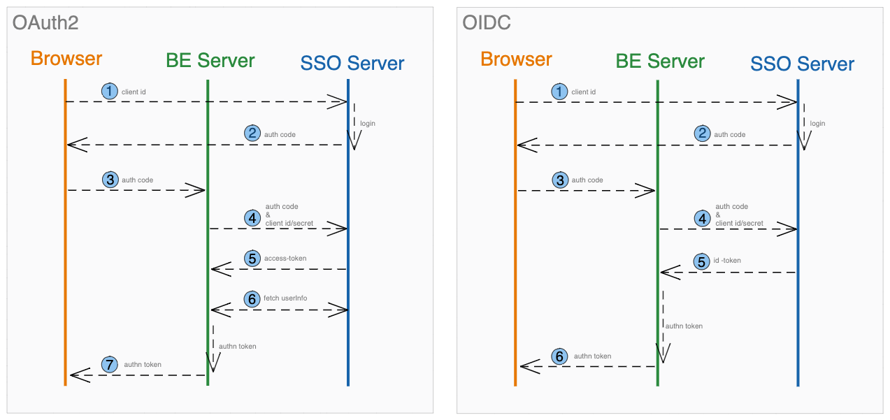

# 前后端分离部署应用的SSO配置实践

## 前言
谈到SSO，我们第一念头也许是Single Sign On，单点登录。也许会映射到具体产品，比如Azure AD配置，或Github配置，或VX配置相关。SSO是一种思想概念，具体实现又有不同方式，比如CAS，OAUTH2/OIDC。

在项目实践中，我们常常能听到OAuth2或者OIDC，以及基于此协议实现的一些框架lib。说到这里，既然有框架，基于框架必然有已实现的案例，则实现必不会过于复杂。实际也确实如此，在微服务架构中，大多数登录服务会在业务服务上游，因此可以将OAuth2框架集成在登录服务中，在登录成功后再将流量路由到下游具体业务服务。亦或是单体架构，也可如此集成实现。

但在前后端分离部署应用中，在引用OAuth2框架后，仍需要将前后端处理流程统一起来。但在前后端使用不同语言并部署在不同的Container或VM时，就需要对后端引入的OAuth2框架的默认流程进行部分修改处理。本文对此类应用模式的OAuth2集成实践进行梳理记录，提供相应的解决方案。

## OAUTH2 / OIDC
OAuth, 通常是指OAuth 2.0协议，它是一种Authorization协议并不是一种Authentication协议，虽然OAuth 2的流程中只描述了Authorization。但是在实际使用中，Authorization脱离Authentication并没有任何意义。因此，有时提到OAuth2，必然也会提到OIDC。OIDC全称OpenID Connect，是基于OAuth2.0扩展出来的一个协议。除了能够OAuth2.0中的Authorization场景，还额外定义了Authentication的场景，其可以理解为基于OAuth2的再扩展。

笔者此处将根据Browser/Server架构阐述OAuth2及OIDC的具体的某一种实现流程，希望能使读者对此有更清晰的理解。  
注：以下均为授权码流程 

### OAuth2在B/S架构中流程
1、SSO事件触发，浏览器重定向到SSO Server进行认证登录  
2、在已登录状态下或登录成功后，SSO Server将重定向（浏览器）至预设定的Redirect_Uri上，并在URL中返回重要参数信息Authorization Code（授权码）  
3、浏览器将获取的所有参数信息（包括授权码等）发送至后端Server   
4、后端Server将获取的信息校验后结合后端定义的Client Id和Client Secret信息，与SSO Server进行交互，以保证请求的正确性和安全性  
5、请求成功，SSO Server将返回access-token等数据至后端Server  
6、后端根据access-token再次与SSO Server交互以获取当前用户信息   
7、根据获取的用户信息在后端Server构造认证凭证并返回前端（浏览器）   


### OIDC在B/S架构中流程
1、SSO事件触发，浏览器重定向到SSO Server进行认证登录。**重定向链接的scope参数需包含openid，以此标识为OIDC流程**  
2、在已登录状态下或登录成功后，SSO Server将重定向（浏览器）至预设定的Redirect_Uri上，并在URL中返回重要参数信息Authorization Code（授权码）  
3、浏览器将获取的所有参数信息（包括授权码等）发送至后端Server   
4、后端Server将获取的信息校验后结合后端定义的Client Id和Client Secret信息，与SSO Server进行交互，以保证请求的正确性和安全性  
5、请求成功，SSO Server将返回access-token和**id-token**等数据至后端Server   
6、校验id-token后获取其中的用户信息，并在后端Server构造认证凭证并返回前端（浏览器） 

<!-- 两个流程图 -->


根据以上对比，可发现两种协议实现思路的区别，但无论方式如何，最终目的仍是从SSO Server获取当前登录用户信息以适应当前系统服务。
此处，笔者强调一个较为细节的区别点，在OIDC的第1步，重定向链接中会多一个参数为nonce，此参数将会在第5步作为id-token的claims的一对key/value进行返回。其主要作用在于减缓重放攻击。

此处笔者将OAuth2授权码模式流程以较为详细的方式进行梳理阐述。关于协议及其他模式，读者可查看自行搜索查看详细信息。 

## Spring Security OAuth2 Client 核心流程
在Spring框架的后端服务中，提到认证和授权，大部分情况都会涉及Spring Security，那么在涉及OAuth2时便必然需要Spring Security OAuth2相关的依赖。此节将对此框架中核心的Filter进行简短解析，以熟悉整套OAuth2/OIDC流程的具体实现方式。

- OAuth2AuthorizationRequestRedirectFilter: 实现重定向至SSO Server获取auth code
- OAuth2LoginAuthenticationFilter: 拦截预配置的Redirect Uri，根据auth code等信息与SSO Server就交互认证获取UserInfo
- OidcAuthorizationCodeAuthenticationProvider：提供依据Oidc协议的具体认证方法
<!-- - OAuth2LoginAuthenticationProvider：提供依据OAuth2协议的具体认证方法 -->

源码分析：

1. `OAuth2AuthorizationRequestRedirectFilter.doFilterInternal`  
根据OAuth2 Client配置信息，包括Client Id/Secret, Redirect Uri等构造重定向URL并进行重定向以获取auth code。同时，将配置信息以`OAuth2AuthorizationRequest`对象保存，用于后续校验。

```java
protected void doFilterInternal(HttpServletRequest request, HttpServletResponse response,FilterChain filterChain) throws ServletException, IOException {
  try {
    // 根据OAuth2 Client配置信息构造 OAuth2AuthorizationRequest
    OAuth2AuthorizationRequest authorizationRequest = this.authorizationRequestResolver.resolve(request);
    if (authorizationRequest != null) {
        // 重定向至SSO Server
      this.sendRedirectForAuthorization(request, response, authorizationRequest);
      return;
    }
  } catch (Exception var11) {
    this.unsuccessfulRedirectForAuthorization(request, response, var11);
    return;
  }
  ......
}

private void sendRedirectForAuthorization(HttpServletRequest request, HttpServletResponseresponse, OAuth2AuthorizationRequest authorizationRequest) throws IOException {
    // 授权码模式，保存OAuth2AuthorizationRequest，重定向
  if (AuthorizationGrantType.AUTHORIZATION_CODE.equals(authorizationRequest.getGrantType())) {
    this.authorizationRequestRepository.saveAuthorizationRequest(authorizationRequest, request, response);
  }
  this.authorizationRedirectStrategy.sendRedirect(request, response, authorizationRequest.getAuthorizationRequestUri());
}

// OAuth2AuthorizationRequest对象信息用于保证SSO登录过程的安全性，其中包含clientId，redirectUri，scope，state，nonce等信息。关于这些字段具体含义，可查看Oidc协议或相关文档。
```

当在SSO Server登录后，SSO Server会根据配置的Redirect Uri重定向回SSO client服务。  
2. `OAuth2LoginAuthenticationFilter.attemptAuthentication`

根据重定向回来的Uri参数，获取auth code，并根据当前的client配置与SSO Serve进行认证，校验，成功后返回认证结果Authentication对象。

```java
public Authentication attemptAuthentication(HttpServletRequest request, HttpServletResponse response) throws AuthenticationException {
    if (!OAuth2AuthorizationResponseUtils.isAuthorizationResponse(params)) {
        .....
    } else { // url中获取正确auth code后的处理流程
        // 获取第1步重定向至SSO Server的请求信息 (OAuth2AuthorizationRequestRedirectFilter中完成的存储动作)
      OAuth2AuthorizationRequest authorizationRequest = this.authorizationRequestRepository.removeAuthorizationRequest(request, response);
      if (authorizationRequest == null) {
        throw new OAuth2AuthenticationException(...);
      } else {
        // 确保服务已配置此SSO Server的信息
        String registrationId = (String)authorizationRequest.getAttribute("registration_id");
        ClientRegistration clientRegistration = this.clientRegistrationRepository.findByRegistrationId(registrationId);
        if (clientRegistration == null) {
          throw new OAuth2AuthenticationException(...);
        } else {
          ......
          // 构造包含client相关信息的对象
          OAuth2LoginAuthenticationToken authenticationRequest = new OAuth2LoginAuthenticationToken(clientRegistration, new OAuth2AuthorizationExchange(authorizationRequest, authorizationResponse));
          //  [*重*] 调用对应的 AuthenticationProvider 进行对应的认证流程
          OAuth2LoginAuthenticationToken authenticationResult = (OAuth2LoginAuthenticationToken)this.getAuthenticationManager().authenticate(authenticationRequest);
          OAuth2AuthenticationToken oauth2Authentication = (OAuth2AuthenticationToken)this.authenticationResultConverter.convert(authenticationResult);
          Assert.notNull(oauth2Authentication, "authentication result cannot be null");
          ......
          return oauth2Authentication;
        }
      }
    }
  }
```
在AuthenticationFilter中，只要可以返回正常的Authentication对象，则说明认证成功，SpringSecurity会将Authentication存入的ecurityContext中，并执行successfulHandler进行认证成功后处理。  

在此Filter中，比较重要的是调用对应的AuthenticationProvider进行认证流程，以下将对OIDC流程的具体认证方法简单分析。
注：若使用OIDC认证流程，则在第1步重定向的URL中的scope参数中需存在openid参数。

3. `OidcAuthorizationCodeAuthenticationProvider.authenticate`
在Spring Security中存在很多的AuthenticationProvider的子类，都是对不同的认证方式的具体认证逻辑的实现。在认证成功后会返回Authentication对象，此处分析的是OIDC流程中AuthenticationProvider
涉及了与SSO Server的交互获取access-token，id-token等信息，以及token校验和构造认证的Authentication。
```java
public Authentication authenticate(Authentication authentication) throws AuthenticationException {
    // oidc流程
  if (!authorizationCodeAuthentication.getAuthorizationExchange().getAuthorizationRequest().getScopes().contains("openid")) {
    return null;
  } else {
    OAuth2AuthorizationRequest authorizationRequest = authorizationCodeAuthentication.getAuthorizationExchange().getAuthorizationRequest();
    OAuth2AuthorizationResponse authorizationResponse = authorizationCodeAuthentication.getAuthorizationExchange().getAuthorizationResponse();
    if ... // 校验
    } else {
        // fetch access-token等信息，应包括id-token
      OAuth2AccessTokenResponse accessTokenResponse = this.getResponse(authorizationCodeAuthentication);
      ClientRegistration clientRegistration = authorizationCodeAuthentication.getClientRegistration();
      Map<String, Object> additionalParameters = accessTokenResponse.getAdditionalParameters(); // id-token 存于此
      if (!additionalParameters.containsKey("id_token")) {
        throw new OAuth2AuthenticationException(invalidIdTokenError, invalidIdTokenError.toString());
      } else {
        // 解析id-token，构造id-token对象
        OidcIdToken idToken = this.createOidcToken(clientRegistration, accessTokenResponse);
        // 校验id-token中claims的nonce属性是否与第1步重定向URL中的nonce参数值匹配
        this.validateNonce(authorizationRequest, idToken);
        // 校验通过后，构造User对象，此时，与SSO Server认证成功，进入后处理
        OidcUser oidcUser = (OidcUser)this.userService.loadUser(new OidcUserRequest(clientRegistration, accessTokenResponse.getAccessToken(), idToken, additionalParameters));
        ......
        // 交互信息汇总，返回上层
        OAuth2LoginAuthenticationToken authenticationResult = new OAuth2LoginAuthenticationToken(authorizationCodeAuthentication.getClientRegistration(), authorizationCodeAuthentication.getAuthorizationExchange(), oidcUser, mappedAuthorities, accessTokenResponse.getAccessToken(), accessTokenResponse.getRefreshToken());
        return authenticationResult;
      }
    }
  }
}
```
至于OAuth2的认证方法，可查看`OAuth2LoginAuthenticationProvider`。  

如果你读到这里，也便能发现Spring Security OAuth2 Client已实现了全套OAuth2/OIDC登录流程，只需要进行基础配置即可实现全套功能。  
<!-- 框架实现了整套流程，单体部署的应用可直接使用默认机制，但对于 -->


## 前后端分离部署集成SSO实践

对于前后端分离部署的应用，前端页面资源和后端接口资源分别处于不同的服务器地址，而后端服务器通常会处于受保护的网络。此时SSO配置的Redirect Uri的BaseUrl为前端服务器地址。
应对这种需求，通常存在多种解决方案，其中一种是通过前端应用发起授权请求并处理重定向的操作，后端服务完成其他操作。<br>
具体前后端职责划分如下：<br>
1、前端应用将用户重定向至SSO Server进行授权登录。并处理登录后重定向回来的URL的参数信息，包括授权码等，发送至后端服务。<br>
2、后端服务接收到授权码后与SSO Server交互获取用户信息并构造认证凭证完成登录流程。<br>

<!-- 当然，此处可在后端自定义处理逻辑来实现交互流程。 -->
在上节，笔者已阐述SpringSecurityOAuth2Client的基本处理逻辑，如何配置SpringSecurityOAuth2Client框架来适应这种情况呢？<br>
此节将以Azure AD作为SSO Server，结合SpringSecurity框架，给出前后端分离部署集成SSO(OIDC)的实践示例。<br>
给出具体分析之前，再次分析Security框架提供的默认机制。
- 因重定向至SSO Server授权页面操作不再由后端发起，不需要触发`OAuth2AuthorizationRequestRedirectFilter`流程，但仍需要构造`OAuth2AuthorizationRequest`并保存以在`OAuth2LoginAuthenticationFilter`中的认证过程中进行信息提取和校验。
- `OAuth2AuthorizationRequest`中的*state*和*nonce*参数应由前端应用提供，以保证校验过程的正确性。

注：以下仅展示核心代码。

1. 前端应用触发后重定向至授权登录页面
```js
// first: gen & save nonce
// then:
window.location.href = `https://login.microsoftonline.com/${tenantId}/oauth2/v2.0/authorize?client_id=${clientId}&response_type=code&redirect_uri=${redirectUri}&response_mode=query&scope=offline_access%20profile%20openid&state=${state}&nonce=${nonce}`;
// 注：此处URL中nonce的值应为hash后的值，save的nonce应为初始值
```
- tenantId, clientId, redirectUri为SSO Server端已配置的信息。
- state, nonce 在前端应用生成的随机字符串。

2. 前端应用解析SSO Server授权登录后的授权码等信息，并发送至后端
```js
// first: get nonce
// then:
const searchParams = new URLSearchParams(window.location.search);
const authCode = searchParams.get('code');
if (authCode != null) {
  axios.get('/login/oauth2/code/azure', {
    params: {
        ...searchParams,
        nonce,
    }
  })
}
```
SpringSecurityOAuth2Client框架获取auth code进行后续处理的默认API path为**/login/oauth2/code/{registerId}**，若无特殊处理，可直接请求此接口触发后续流程。
3. 后端服务自定义过滤器构造`OAuth2AuthorizationRequest`
自定义的Filter依据`OAuth2AuthorizationRequestRedirectFilter`实现，核心区别在于，自定义Filter只保存`OAuth2AuthorizationRequest`对象，不进行Redirect操作。
此处也将前端应用第1步重定向用的参数保存更新至`OAuth2AuthorizationRequest`对象。
```java
public class AuthorizationRequestSaveFilter extends OncePerRequestFilter {

  // 在指定请求中执行操作
  public static final String AUTHORIZATION_REQUEST_URI = "/login/oauth2/code";
  private OAuth2AuthorizationRequestResolver authorizationRequestResolver;
  private AuthorizationRequestRepository<OAuth2AuthorizationRequest> authorizationRequestRepository;

  public AuthorizationRequestSaveFilter(ClientRegistrationRepository clientRegistrationRepository) {
    this.authorizationRequestRepository = new HttpSessionOAuth2AuthorizationRequestRepository();
    this.authorizationRequestResolver = new DefaultOAuth2AuthorizationRequestResolver(clientRegistrationRepository, AUTHORIZATION_REQUEST_URI);
  }

  @Override
  protected void doFilterInternal(
      HttpServletRequest request, HttpServletResponse response, FilterChain filterChain)
      throws ServletException, IOException {

    if (request.getRequestURI().contains(AUTHORIZATION_REQUEST_URI)) {
      try {
        String state = request.getParameter("state");
        String nonce = request.getParameter("nonce");
        OAuth2AuthorizationRequest authorizationRequest = this.authorizationRequestResolver.resolve(request);
        Map<String, Object> currentAttributes = new LinkedHashMap<>(authorizationRequest.getAttributes());
        currentAttributes.replace("nonce", nonce);
        // 对框架默认流程构造出的OAuth2AuthorizationRequest的部分参数 替换为 前端传递的真实使用的值 （state, nonce）
        OAuth2AuthorizationRequest authorizationRequestWithFE =
            OAuth2AuthorizationRequest.from(authorizationRequest)
                .state(state)
                .attributes(currentAttributes)
                .build();

        // 保存 OAuth2AuthorizationRequest 
        this.authorizationRequestRepository.saveAuthorizationRequest(authorizationRequestWithFE, request, response);
      } catch (Exception ex) {
        // handle exception
      }
    }
    filterChain.doFilter(request, response);
  }
}
```
注：state, nonce值会在后续流程进行匹配校验。这两值的作用可增强安全性，具体信息可查看参考介绍。
下一步，此请求将进入`OAuth2LoginAuthenticationFilter`开启后续的操作，即获取id-token，构造User对象，完成认证流程。
通常而言，在认证完成后，会采用自定义的successfulHandler进行认证后处理操作，比如生成Jwt-token返回前端等。此处不再阐述。

当然，还有一些配置工作，比如将自定义的Filter加入SecurityFilterChain，以及SSO Client的基础信息配置。以下给出示例：
```java
    public SecurityFilterChain securityFilterChain(HttpSecurity http) throws Exception {
    http.authorizeHttpRequests(
            (authorize) ->
                authorize
                    .requestMatchers("/login/oauth2/code/**")
                    .permitAll()
                    .requestMatchers("/**")
                    .authenticated())
    http.with(AadWebApplicationHttpSecurityConfigurer.aadWebApplication(), Customizer.withDefaults()) // 集成 Auzre AD lib的默认配置
        .oauth2Login(oauth -> oauth.successHandler(customizedSuccessHandler)) // 开启oauth2 login， 并添加自定义successHandler
        .addFilterBefore(new AuthorizationRequestSaveFilter(clientRegistrationRepository), OAuth2AuthorizationRequestRedirectFilter.class); // 自定义Filter加入FilterChain
    return http.build();
  }
```

至此，我们通过编写部分代码，集成SpringSecurityOAuth2Client，实现了SSO登录。

在笔者记录此实践过程时，也探索了其他的实现方式，或简单或复杂，若读者有较好实践思路，也可进行实现。

## 结语
SSO登录常见功能需求。OIDC/OAUTH2是基于此的协议。基于此协议的实现框架有很多。

本文基于对Spring Security和OAuth2 Client框架的认知，结合具体实践场景前后端分离部署的应用，给出了一种实践方案，或许不足，但确实可行。
希望读者看到此处后，能对OIDC/OAUTH2的流程和OAuth2 Client框架有更清晰的理解。

笔者仅以此文记录实际情况的实践方式，经验浅薄，若有不足，还请指正。

参考：<br>
OAUTH2：https://learn.microsoft.com/en-us/entra/identity-platform/v2-oauth2-auth-code-flow  
OIDC：https://learn.microsoft.com/en-us/entra/identity-platform/v2-protocols-oidc  
以下为引用的一段关于nonce的描述：
> A value generated and **sent by your app in its request** for an ID token.   
> The same nonce value is included in the ID token returned to your app by the Microsoft identity platform.   
> To **mitigate token replay attacks**, your app should verify the nonce value in the ID token is the same value it sent when requesting the token.   
> The value is typically a unique, random string.